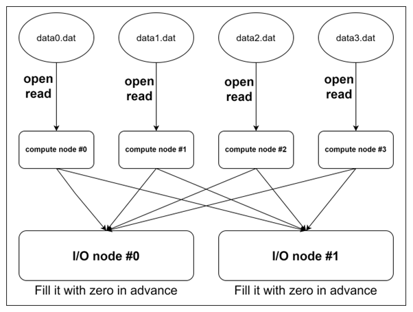

# Basic-parallel-I/O



## How to run?
- 예를 들어 16KB data를 읽고자 할 경우 먼저 `datas` 경로에서 `.dat`파일 제거 후 다음 명령어 수행
- <참고로 16은 데이터 사이즈를 의미한다.>
```bash
$ ./make_dat 16
```

- 다시 상위 경로로 돌아가서 다음 명령어 수행
```bash
$ ./main 16
```

- `received0.dat` 파일과 `received1.dat` 파일이 생성됨
- 다음 명령어를 수행함으로써 데이터를 확인 가능
```bash
$ ./printer
$ ./printer1
```

- 64KB data를 읽고자 할 경우 처음부터 반복
